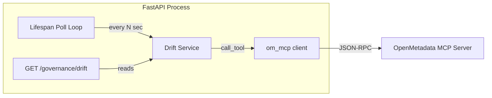

# Governance Engine

> Phase 2 deliverable. Drift detection and governance lifecycle management for OpenMetadata entities.

## Overview

The governance engine detects when live OpenMetadata entities diverge from an approved baseline ("drift") and exposes findings via a REST API endpoint. It runs as a background task in the FastAPI lifespan, polling OM at a configurable interval.

## Architecture

## Drift Signals

| Signal           | Description                                         | Detection Method                              |
| ---------------- | --------------------------------------------------- | --------------------------------------------- |
| `hash_changed`   | Entity fields (description, columns, tags) changed  | SHA-256 of canonicalised entity fields         |
| `tag_missing`    | Expected governance tag removed from entity         | Set difference: baseline tags − current tags   |
| `tag_unexpected` | New governance tag appeared that wasn't in baseline | Set difference: current tags − baseline tags   |

Governance tag prefixes monitored: `PII.`, `Tier.`, `PersonalData.`

## Components

| File                            | Layer    | Responsibility                             |
| ------------------------------- | -------- | ------------------------------------------ |
| `src/copilot/services/drift.py` | Service  | Pure drift logic: hash, tag compare, scan  |
| `src/copilot/api/governance.py` | API      | `GET /api/v1/governance/drift` route       |
| `src/copilot/api/main.py`       | API      | Lifespan poll loop (background task)       |
| `src/copilot/config/settings.py`| Config   | `drift_poll_interval_seconds` setting      |

## Configuration

| Env Var                         | Default | Description                       |
| ------------------------------- | ------- | --------------------------------- |
| `DRIFT_POLL_INTERVAL_SECONDS`   | 60.0    | Seconds between background scans |

## NFR Compliance

- **Timeout + retry**: Drift scan uses `om_mcp.call_tool` which has circuit breaker (5 failures / 30s cooldown) + retry (3 attempts, exponential backoff) per NFRs.md.
- **Crash resilience**: Poll loop catches all exceptions; never crashes the process (NFR-03).
- **Structured errors**: GET /governance/drift returns 503 with error envelope when OM is down (per APIContract.md).

## Test Coverage

- `tests/unit/test_drift.py`: Pure logic (hash, tags, detect_drift)
- `tests/unit/test_governance_api.py`: Integration tests with mocked MCP
